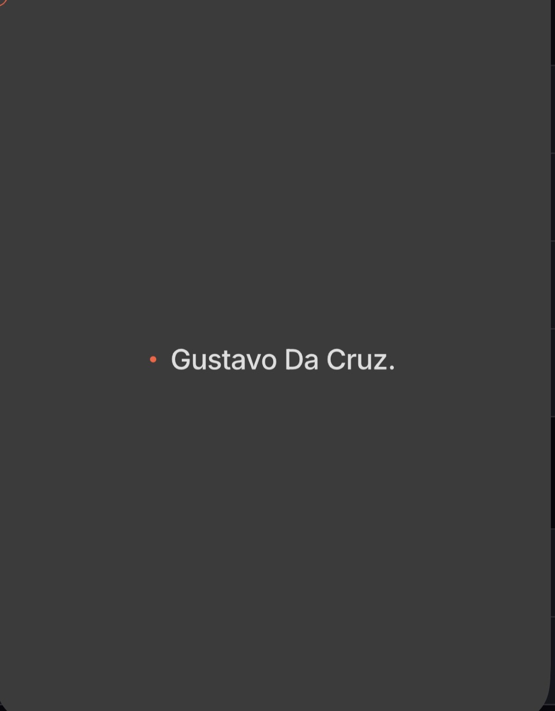

<!-- BANNER SUPERIOR -->

  

<!-- TYPING ANIMATION -->

  

<!-- PROFILE VIEWS -->

  
  

-----

## 👨‍💻 Sobre mim

<table>
<tr>
<td width="60%" valign="top">

🎯 **Foco atual:** front-end com atenção a detalhes visuais e animações fluidas

🎓 Cursando **Análise e Desenvolvimento de Sistemas** na **FIAP**

🔭 Construindo meu [portfólio pessoal](https://gustavosp4591-lab.github.io) com GSAP e design editorial

🌱 Aprofundando em **JavaScript moderno** e fundamentos de **Java**

💬 Me pergunta sobre: **animações web, GSAP, CSS avançado**

⚡ Fun fact: inspiração vem tanto de dev quanto de design editorial

📫 **Aberto a oportunidades de estágio front-end!**

</td>
<td width="40%" valign="top">

</td>
</tr>
</table>

-----

## 🌐 Contato & Redes

  
  
  
  

-----

## 🛠️ Tech Stack

**Usando no dia a dia**

  

**Estudando agora**

  

-----

## 📊 GitHub Stats

  
  

  

-----

## 🚀 Projeto em destaque

  

### 🎨 [Portfólio Pessoal](https://gustavosp4591-lab.github.io)

Site pessoal construído do zero com **HTML, CSS, JavaScript e GSAP**. Design editorial inspirado em Dennis Snellenberg, com preloader multilíngue, marquee animado, hero com parallax, lista de projetos com preview flutuante seguindo o cursor e cursor customizado.

**🎯 Score Lighthouse:** 100 Desktop / 93 Mobile

-----

## 📈 Atividade recente

  

-----

  <i>💡 <b>Recrutador(a)?</b> Tô disponível pra estágio front-end. Dá uma olhada no meu <a href="https://gustavosp4591-lab.github.io">portfólio</a> e vamos conversar!</i>

<!-- BANNER INFERIOR -->

  

